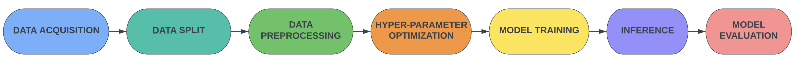

This section consists of Machine Learning workflows, with examples showing various steps in a conventional machine learning pipelines (data-preprocessing, model training, model evaluation, model inference etc). The purpose of these workflows is to exhibit how Pegasus can be utilized in order to parallelize various time consuming components of a machine learning pipeline, mainly data pre-processing or model inferencing. Moreover, machine learning workflows come in handy for experimentation with different input datasets or parameters, thus making it easier to replicate and compare results. The workflows cover different machine learning sub-tasks such as ***Image Segmentation, Classification or Audio Recognition***.

Lung Segmentation
=================
Precise detection of the borders of organs and lesions in medical images such as X-rays, CT, or MRI scans is an essential step towards correct diagnosis and treatment planning. We implement a workflow that employs supervised learning techniques to locate lungs on X-ray images. Lung instance segmentation workflow uses [Chest X-ray](https://www.ncbi.nlm.nih.gov/pmc/articles/PMC4256233/) for predicting lung masks from the images using [U-Net](https://arxiv.org/abs/1505.04597) model.

The workflow uses a ***Chest X-ray Masks*** and Labels dataset (high-resolution X-ray images and masks) availabe publicly. The dataset is split into training, validation, and test sets before the workflow starts. Each set consists of original lung images and their associated masks. The ***Pre-processing*** step and Data Augmentation of Images is done to resize images (lungs and masks) and normalize lung X-rays. Additionally, for each pair of lung image and mask in the train dataset, two new pairs are generated through ***image augmentation*** (e.g., rotations, flips). Next, the train and validation data are passed to the UNet ***hyperparameter optimization*** step, where different learning rates are explored. The ***training*** of UNet fine-tunes the UNet model with the recommended learning rate on the concatenated train and validation set, and obtains the weights. Then ***inference*** on Unet is done using the trained model to generate masks for the test X-ray images. Finally, the ***evaluation*** is performed in order to generate a PDF file with the scores for relevant performance metrics and prints examples of lung segmentation images produced by the model.

  

**Machine Learning steps in the workflow :**

  

Mask Detection
==============
The workflow addresses the problem of determining what percentage of the population is properly wearing masks to better track our collective efforts in preventing the spread of COVID-19 in public spaces. It uses the FastRCNNPredictor deep learning model to detect masks on faces.

  

Orca Sound
==========
This workflow processes and analyzes the hydrophone data of sensors from **three locations** in the state of **Washington**, and uses trained machine learning models to automatically identify the whistles of the Orcas.

  

